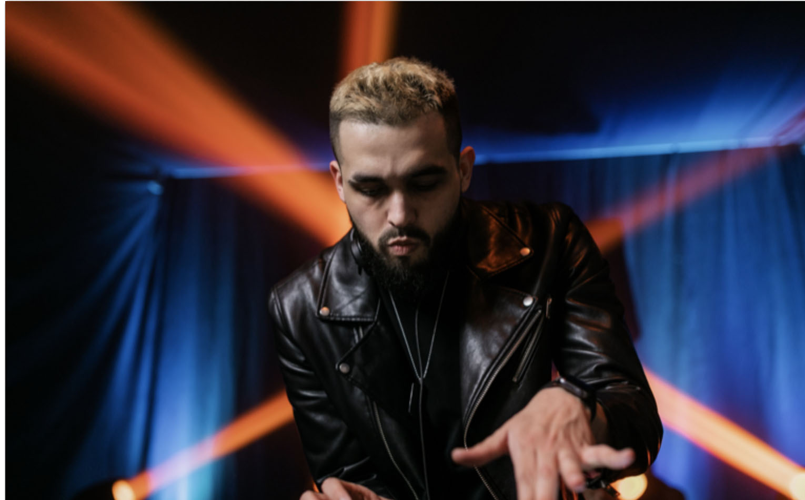
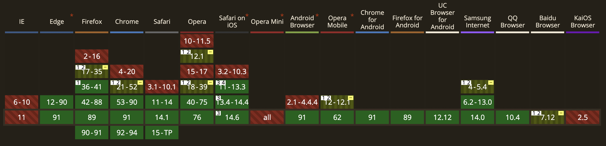

## Paddle.js

https://paddlejs.baidu.com/model

### Demo

https://paddlejs.baidu.com/humanStream

### Paddle.js 人像分割 + 声网

[http://blog.givebest.cn/virtual-background/](http://blog.givebest.cn/virtual-background/)

###  人像分割

#### 01

#### 02

#### 03

#### 04

#### 05

#### 06

#### 07

#### 08

### 建议

由于声网[虚拟背景插件](https://docs.agora.io/cn/live-streaming-premium-legacy/virtual_background_web_ng?platform=Web)官网有如下注意事项：

>不建议在 Firefox 和 Safari 上开启虚拟背景。Firefox 切后台可能导致画面冻结；Safari 上由于浏览器自身性能问题，效果不佳。
>
>不建议在移动端上开启虚拟背景。

即声网虚拟背景插件对 Firefox、Safari、移动端支持不佳。

Paddle.js 人像分割支持如下：

https://github.com/PaddlePaddle/Paddle.js/tree/v2.1.0/packages/paddlejs-examples/humanStream

可看到支持大部分主流浏览器和移动端浏览器。

经过测试，人像分割对比声网有待改进之处，如果启用虚拟背景图效果可能会出现上图 [01](#01)、[02](#02)、[03](#03) 现象。

所以建议 PC 端保持使用`声网虚拟背景`获得更好的人像分割体验，移动端可使用`Paddle.js` 的人像分割支持移动设备的虚拟背景功能。

但由于 `Paddle.js`人像分割可能会出现效果不好的场景，可在移动端使用`背景虚化`使人像分割周边色彩相似来弥补（效果可在这里查看：[http://blog.givebest.cn/virtual-background/](http://blog.givebest.cn/virtual-background/)）。

